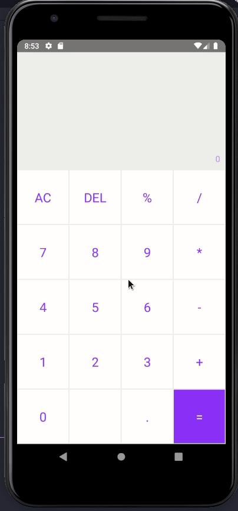

<h1 align="center">
	Calculadora - React Native
</h1>

<p align="center">
  

</p>

## 🛠 Tecnologias

As seguintes ferramentas foram usadas na construção do projeto:

- [React Native](https://reactnative.dev/)
- [styled-components](https://styled-components.com/)

## Pré-requisitos

Antes de começar, você vai precisar ter instalado em sua máquina as seguintes ferramentas:
[Git](https://git-scm.com), [Node.js](https://nodejs.org/en/), [Yarn](https://classic.yarnpkg.com/lang/en/). 
Além disto é bom ter um editor para trabalhar com o código como [VSCode](https://code.visualstudio.com/)

## 💾 Instalação

```bash
# Acesse a pasta do projeto no terminal/cmd
$ cd calculadora-react-native

# Instale as dependências
$ yarn

# Instale o app no emulador
$ yarn android

# Execute a aplicação
$ yarn start
```

---
By Rodrigo Sakamoto

[](https://www.linkedin.com/in/rodrigo-sakamoto/) 
[](mailto:rodosakamoto@gmail.com)